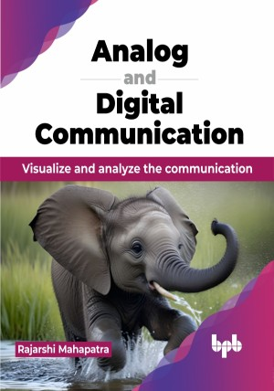

# Analog and Digital Communication

More figures will bridge the gap between mathematics and visualization of the communication system

This is the repository for [Analog and Digital Communication
](https://bpbonline.com/products/analog-and-digital-communication?variant=43807204573384),published by BPB Publications.

## About the Book
In today's tech-driven world, communication systems play a crucial role in sharing information effectively. The book, Analog and Digital Communication helps you grasp the fundamental principles of these systems, enabling you to analyze and visualize information flow.

This book on communication systems teaches you the basics of how information travels. It covers key concepts and tools, showing how analog information is transmitted on a carrier signal using techniques like AM and FM. You will also learn about converting analog signals to digital data and using modulation techniques like ASK and PSK. The book explains handling noise in communication and introduces information theory to understand data capacity and noise impact. It covers performance metrics like BER and channel coding for error correction. Additionally, it explores wireless and optical communication technologies like cellular networks, Wi-Fi, and optical fiber communication.

By the end of this book, you will master analyzing digital modulation, understanding noise in communication, and using error correction methods. You will explore modern wireless and optical communication with light pulses, gaining skills to navigate the communication world confidently.

## What You Will Learn
• Visualize communication techniques.

• Relate the mathematical expressions with communication techniques.

• Find out the importance of different parameters in the performance of the communication system.

• Understand the impact of noise and techniques to overcome it.

• Analyze and design the communication systems.
